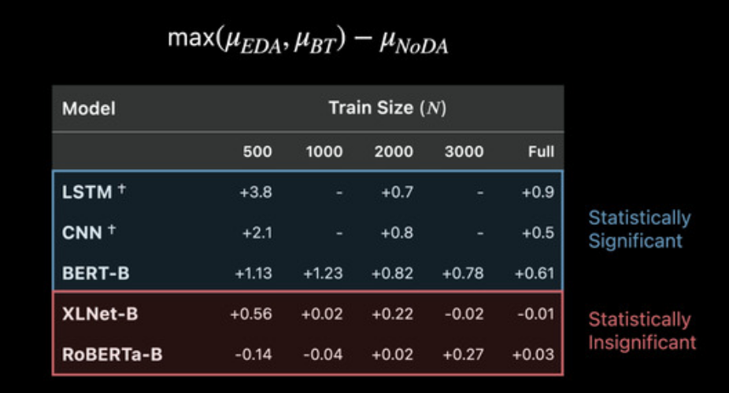
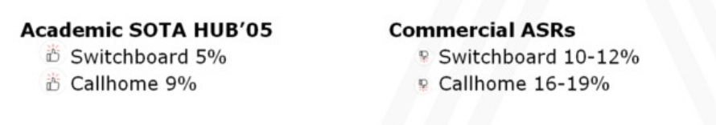

# Negative results workshop

## How Effective is Task-Agnostic Data Augmentation for Pretrained Transformers?

Shayne Longpre, Yu Wang, Chris DuBois

<https://slideslive.com/38940806>
<https://www.aclweb.org/anthology/2020.findings-emnlp.394>

[interesting](8c716ab6-e253-4b05-8167-ad399382adbb)

Task-agnostic data augmentation seems to not work well for pretrained models.

Hypothesis : simple data augmentations are already captured by pretraining task : LSTM benefits more but Roberta does not

What can work : task-specific data augmentations, cases when pretraining domain different from task domain?

Q : Influence of noisy labels?

## WER we are and WER we think we are

Piotr Szymański, Piotr Żelasko, Mikolaj Morzy, Adrian Szymczak, Marzena Żyła-Hoppe, Joanna Banaszczak, Lukasz Augustyniak, Jan Mizgajski, Yishay Carmiel 

<https://slideslive.com/38940634>
<https://www.aclweb.org/anthology/2020.findings-emnlp.295>

[interesting](8c716ab6-e253-4b05-8167-ad399382adbb)

Reported WER on modern ASR systems are super low, is it really the case?

Use call center data to report WER and compare to academic SOTA

