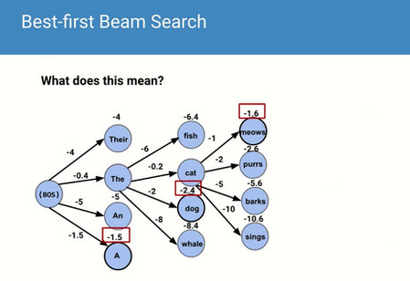
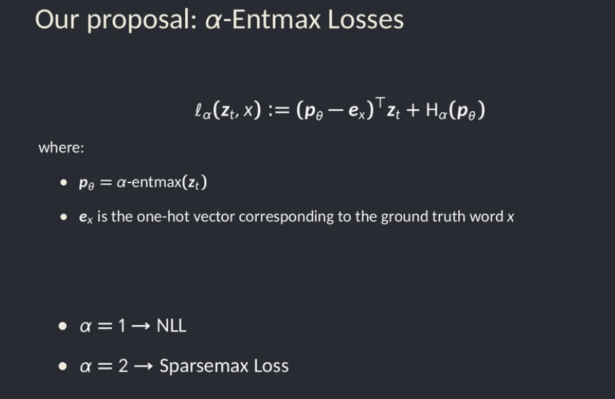
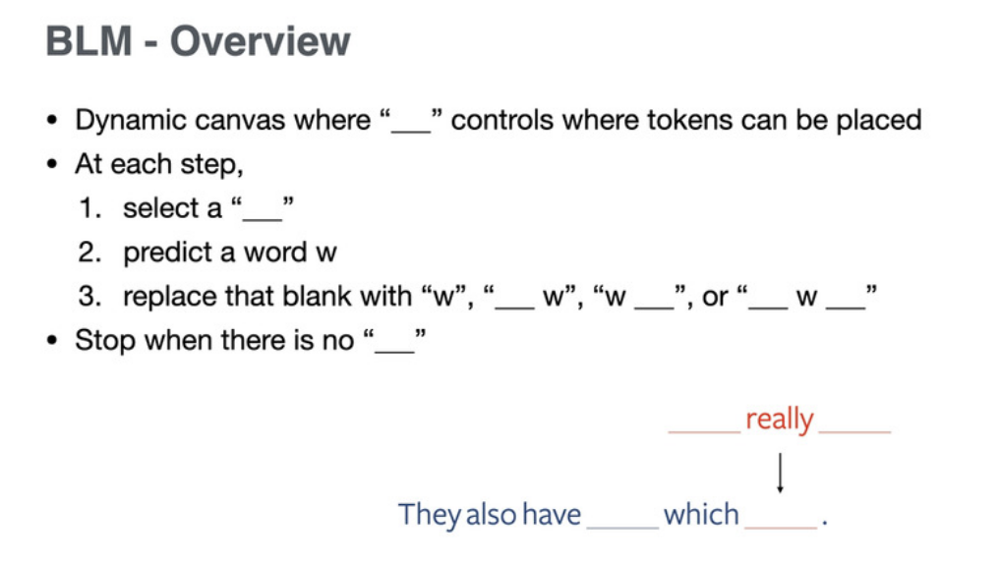

# Day2

## If beam search is the answer, what was the question?

Clara Meister, Ryan Cotterell, Tim Vieira 

<https://slideslive.com/38938891>
<https://www.aclweb.org/anthology/2020.emnlp-main.170>

Beam search is a heuristic that they prove to be equivalent to minimising surprisal

From cognitive science : humans tend to prefer sentences with low surprisal, where information is evenly spread across sentence

"The family (that) you cook for", that is preferred because it spreads start of a new clause and content across 2 words

Propose regularizers to enforce uniform information density

## A\* Beam Search

Clara Meister, Ryan Cotterell, Tim Vieira 

<https://slideslive.com/38939414>
<https://virtual.2020.emnlp.org/paper_TACL.2169.html>

Combinatorial explosion : no markov property

Beam search : pruned BFS

Idea : Best first beam search

total score = sum log (p) for p each word probability

All terms are negative, score decreasing

Idea : Expand highest scoring path, regardless of which step it is at

To get same results as beam search, also limit to k for each round.

Propose generalization for non-monotonic scoring function

## Sparse Text Generation

Pedro Henrique Martins, Zita Marinho, André F. T. Martins 

<https://slideslive.com/38938749>
<https://www.aclweb.org/anthology/2020.emnlp-main.348>

Introduce entmax sampling, more diverse than nucleus sampling but more realistic than softmax sampling

## Blank Language Models

Tianxiao Shen, Victor Quach, Regina Barzilay, Tommi Jaakkola

<https://slideslive.com/38939329>
<https://www.aclweb.org/anthology/2020.emnlp-main.420>

At training, sample trajectories to get to final sentence
At inference, any : beam search, ..

Comment : interesting because blanks can be not only one BPE but noun phrase, ..

[interesting](8c716ab6-e253-4b05-8167-ad399382adbb)

