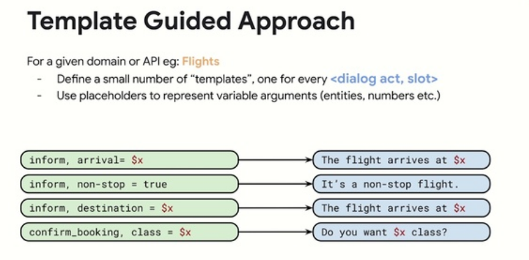

# Day3

## Template Guided Text Generation for Task-Oriented Dialogue

Mihir Kale, Abhinav Rastogi 

<https://slideslive.com/38939152>
<https://www.aclweb.org/anthology/2020.emnlp-main.527>

Idea : use templates for every dialog act-slot

Fill values with API response.
Use seq2seq to make the sentence more natural sounding.

Generalizes to unseen APIs

[interesting](8c716ab6-e253-4b05-8167-ad399382adbb)

