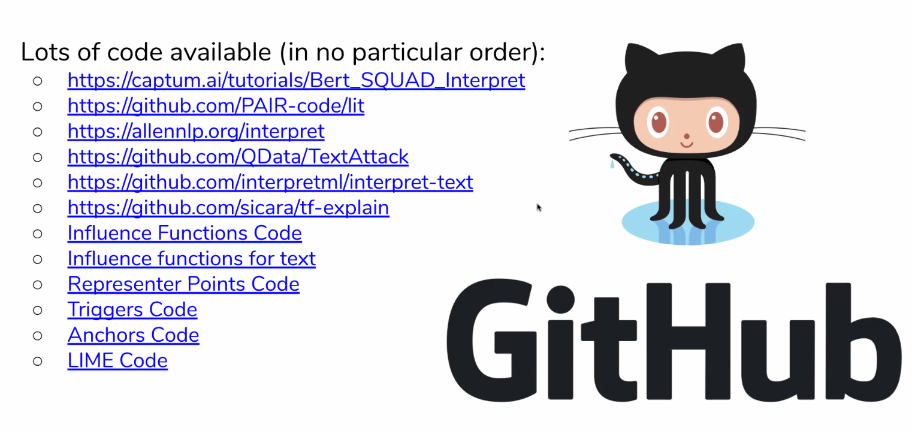

- Use perplexity / delta-perplexity for ranking quality of the samples in terms of our language model :
  [papers.applications.day1](8129589b-ebd7-41fb-91e0-c7866143ea00)
- FAQ using hybrid IR-ESIM approach in "Conversational Document Prediction to Assist Customer Care Agents" [papers.applications.day1](8129589b-ebd7-41fb-91e0-c7866143ea00)
- From "Self-Supervised Meta-Learning for Few-Shot Natural Language Classification Tasks" mask words like Rechnung, Natel, .. to pretrain for the task already [papers.transformers.day1](948323c7-b75c-42e8-bb35-849463e56ea3)
- From "How do Decisions Emerge across Layers in Neural Models? Interpretation with Differentiable Masking" use word-class graph embeddings to improve out of scope detection [papers.interpret.day2](c0486dab-c704-49a3-895c-dc14fb8b73a3)
- NLU OKR : We have capabilities to summarize, understand text and issues of customers, could we not produce dashboards to customer care so they can get a global picture of outages / sudden issues. Summarization, keyword extraction..
- Unsupervised FAQ retrieval with question generation using BERT : <https://www.aclweb.org/anthology/2020.acl-main.74/>
- What could we do if other teams were ready? Example : detect addresses for moving, postpone payment deadline, .. Be more pushy, suggestive?
- Test suite for NLP model robustness <https://github.com/marcotcr/checklist>
- Paper on how to do a second round of in-domain MLM pretraining <https://arxiv.org/abs/2004.10964>
- Real ML generated responses for assistant by using template sentences [papers.dialog.day3](5bdfc9e6-b994-41fd-afad-9feb45f735f2)
- Adversarial training, data augmentation : <https://github.com/QData/TextAttack>
- Topic modeling using ETM [papers.other.day3](972ac840-7000-4a47-aa46-2773e8c3ef60)
- Question answering system : <https://github.com/wyu97/TTQA>
- Agent assistant suggesting URLs or answers : <https://www.youtube.com/watch?v=EeqMLLBWhxQ&feature=youtu.be>
- Approximate nearest neighbours for FAQ speedup <https://github.com/spotify/annoy> )
- Apply truecasing for German from ASR speech before classification [papers.wnut](8d1a05b3-9eea-41b3-97cf-00a5fa7a9d55) (simple experiment : lower case NEO text and compare accuracy with XLMR)
- Student for model interpretability
- Interpretability methods :
  
  Turnover dropout : <https://www.aclweb.org/anthology/2020.sustainlp-1.6.pdf> : One mask per datapoint : the complementary subnetwork is a NN trained without the datapoint
  Errudite : debug datapoints : <https://idl.cs.washington.edu/files/2019-Errudite-ACL.pdf>
- Reranking methods used in NMT could be adapted to ASR to get top 5 and choose most likely

Self :

- Penalize reLU less than zero in loss to avoid saturation?
- Keep track of contributions of datapoints to know based on the activations / region of the loss landscape we are in at inference which datapoints influenced the decision

Few shot exp :

- Autoprompt <https://virtual.2020.emnlp.org/paper_main.2763.html>
  <https://slideslive.com/38939188>
  <https://www.aclweb.org/anthology/2020.emnlp-main.346>
- For zero shot tuning, have humans turn interactive slider to capture correct projection?
- What do LMs know? [papers.transformers.day3](71cc84f8-b271-498e-a001-c6e6d10b7c01)
  <https://virtual.2020.emnlp.org/paper_TACL.2041.html>
  <https://slideslive.com/38939400>
- Prompt ensembling : "How Can We Know What Language Models Know"
  <https://slideslive.com/38939396>
  <https://virtual.2020.emnlp.org/paper_TACL.1983.html>
  <https://arxiv.org/abs/1911.12543>

