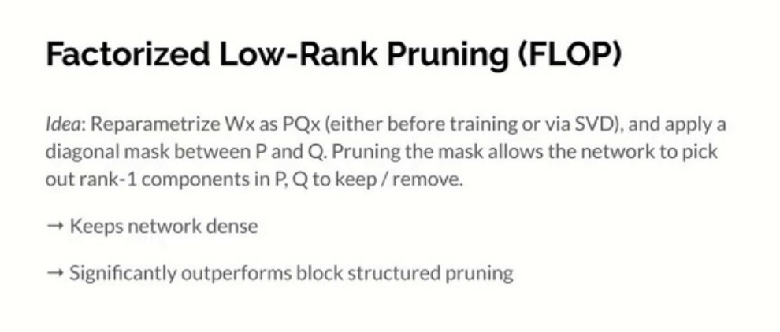
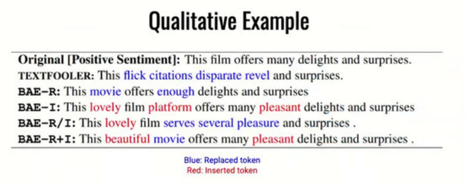
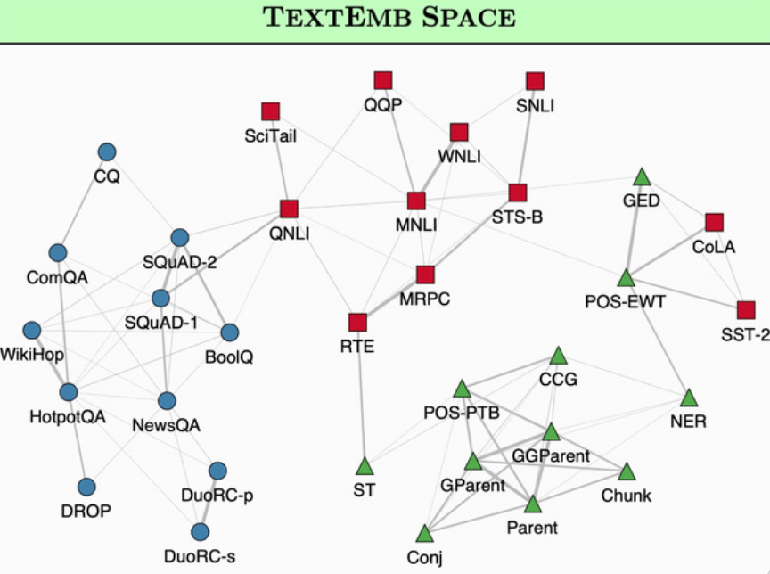
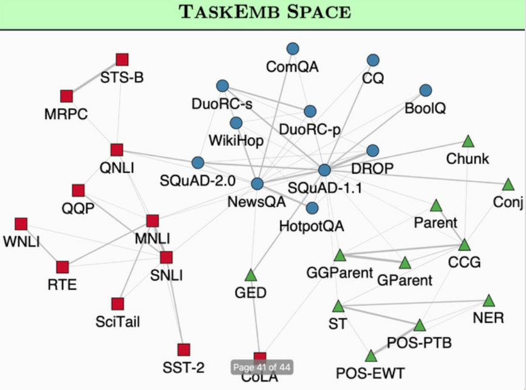
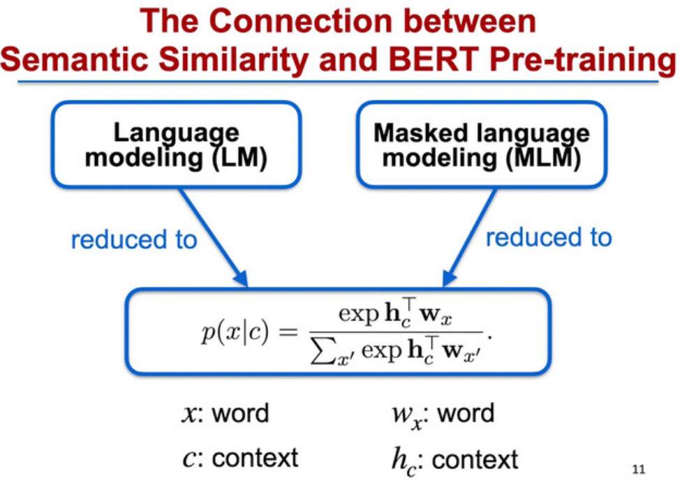
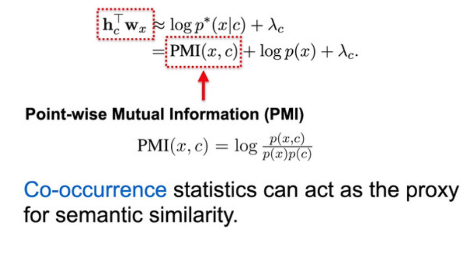
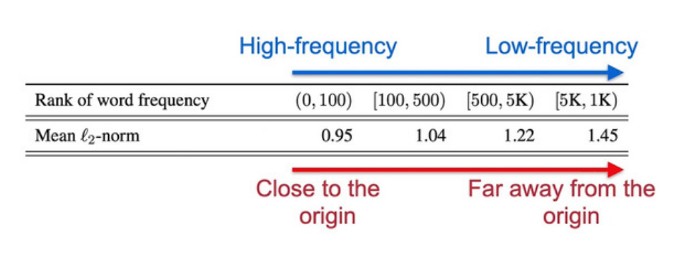
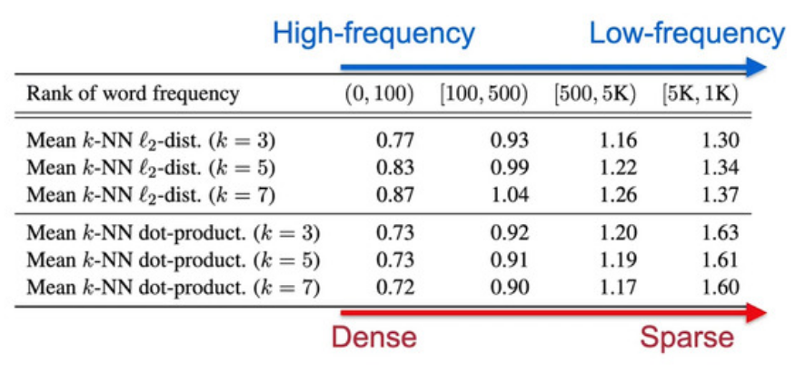

# Day3

## Recall and Learn: Fine-tuning Deep Pretrained Language Models with Less Forgetting

Sanyuan Chen, Yutai Hou, Yiming Cui, Wanxiang Che, Ting Liu, Xiangzhan Yu

<https://slideslive.com/38938976>
<https://www.aclweb.org/anthology/2020.emnlp-main.634>

Catastrophic forgetting during fine-tuning on downstream task.
They propose an optimizer to avoid this using multitask learning to recall the knowledge from pretraining tasks and objective shifting to gradually shift learning on downstream tasks

<https://github.com/Sanyuan-Chen/RecAdam>

## Structured Pruning of Large Language Models

Ziheng Wang, Jeremy Wohlwend, Tao Lei

<https://slideslive.com/38939265>
<https://www.aclweb.org/anthology/2020.emnlp-main.496>

How to do unstructured pruning with speedup?
Use factorization :

W = PQ, introduce diagonal mask between P and Q that the network can learn to remove

[gswtranslation](6ea22ede-ae7b-4746-b548-2a60e608c4f7)

## BAE: BERT-based Adversarial Examples for Text Classification

Siddhant Garg, Goutham Ramakrishnan

<https://slideslive.com/38938695>
<https://www.aclweb.org/anthology/2020.emnlp-main.498>

Can rule based perturbations (synonym, ..) be improved?

Use masking and prediction :

- Replace existing tokens
- Add new tokens in between

Use 2 criteria to select replacements :

- Semantic similarity threshold to keep same meaning as original text
- POS-filter to keep same POS tag to keep similar structure

If after an iteration of above, model prediction changes : success

## oLMpics - On what Language Model Pre-training Captures

Alon Talmor, Yanai Elazar, Yoav Goldberg, Jonathan Berant

Check what types of tasks pretrained models can do :

- Compare ages and tell which one is younger : "A 20 year old is younger/older than a 30 year old".
- "A rhinoceros never/often/always/.. has fur"
- "A horse and a crow are birds/animals"
- Multi-hop reasoning "Out of a 30 year old, 24 YO, 54YO the first/second/third is the oldest"

In total 8 tasks to check what LMs know.

Roberta Large performs better than others

[interesting](8c716ab6-e253-4b05-8167-ad399382adbb)

## Which \*BERT? A Survey Organizing Contextualized Encoders

Patrick Xia, Shijie Wu, Benjamin Van Durme 

<https://slideslive.com/38939146>
<https://www.aclweb.org/anthology/2020.emnlp-main.608>

Variations across BERTs and difficulties in comparing them :

- Different pretraining tasks
- Efficiency : training, distillation, pruning, quantization. Memory, inference time? Unclear
- Single downstream task or multiple?
- Data : Quantity, quality, in-domain, source of data?
- Interpretability : task probing, input probing, weight inspection. Not reliable methods

## Exploring and Predicting Transferability across NLP Tasks

Tu Vu, Tong Wang, Tsendsuren Munkhdalai, Alessandro Sordoni, Adam Trischler, Andrew Mattarella-Micke, Subhransu Maji, Mohit Iyyer 

<https://slideslive.com/38939047>
<https://www.aclweb.org/anthology/2020.emnlp-main.635>

Which tasks could be useful as intermediate tasks before finetuning for target task?

General answer : transfer better than expected

How to know which tasks are compatible? task2vec approach Achille et al.

## Discriminatively-Tuned Generative Classifiers for Robust Natural Language Inference

Xiaoan Ding, Tianyu Liu, Baobao Chang, Zhifang Sui, Kevin Gimpel 

<https://slideslive.com/38938994>
<https://www.aclweb.org/anthology/2020.emnlp-main.657>

More robust and sample efficient using generative model

It seems their model performs better for very low amounts of data &lt;1K and for very noisy conditions >30% label noise, but in other cases Roberta is better. Does it mean that robustness comes at a cost of accuracy?

## On the Sentence Embeddings from Pre-trained Language Models

Bohan Li, Hao Zhou, Junxian He, Mingxuan Wang, Yiming Yang, Lei Li 

<https://slideslive.com/38939378>
<https://www.aclweb.org/anthology/2020.emnlp-main.733>
<https://github.com/bohanli/BERT-flow>

BERT word embedding averaging perform poorly for sentence semantic similarity tasks if we don't finetune.

Understanding connection between semantic similarity and pre-training :

- Pre-training :
  
  

First observation :
Extra term log(p(x)) represents frequency of words :

If embeddings are distributed in different regions due to frequency statistics, induced similarity is not useful anymore, log(p(x)) not constant.

Second observation :

Low frequency => sparse embeddings, meaning poorly defined

Propose BERT-flow : invertible mapping from BERT embedding space to Gaussian latent space => isotropic, no holes

