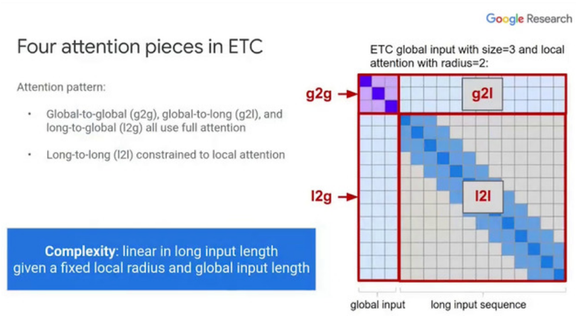
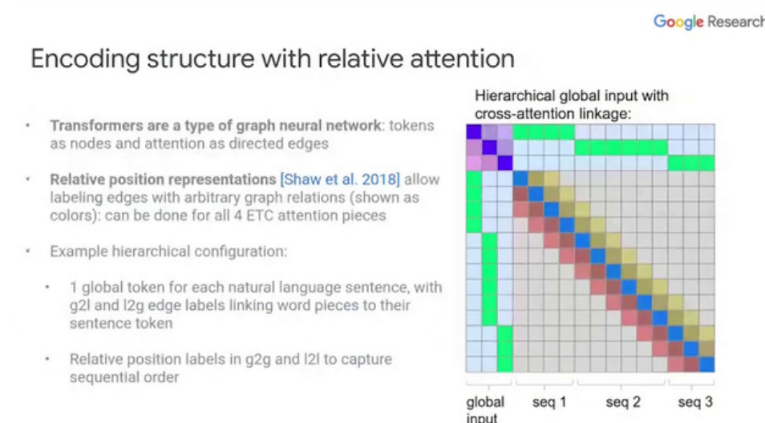

# Day1

## Pre-Training Transformers as Energy-Based Cloze Models

Kevin Clark, Minh-Thang Luong, Quoc Le, Christopher D. Manning 

<https://slideslive.com/38939095>
<https://www.aclweb.org/anthology/2020.emnlp-main.20>

- Autoregressive LMs good for scoring sentences : P(a) _ P(b | a) _ ... but no easy way to do this with BERT due to masking task

- Idea : Electric model : predict all words simultaneously without masking

- Energy-based model, assigns a scalar score to each word. Does not use softmax but outputs unnormalized scores which avoids expensive renormalization

- Use noise contrastive estimation : turn generation task into binary classification task, model has to distinguish between in-distribution tokens / fake tokens

- Better than Electra, replace generator by noise distribution and discriminator by binary classifier

- ELECTRA is "negative sampling" version of BERT

- Requires O(1) transformer passes to do scoring / reranking
  
  [interesting](8c716ab6-e253-4b05-8167-ad399382adbb)

## Calibration of Pre-trained Transformers

Shrey Desai, Greg Durrett

<https://slideslive.com/38939157>
<https://www.aclweb.org/anthology/2020.emnlp-main.21>

- BERT models can make mistakes with output probabilities
  => Need for posterior calibration

- Use Expected Calibration Error as metric but wish for high accuracy as well

- Tasks : NLI, Paraphrase Detection, Commonsense Reasoning

- In-domain : Transformer-based models generally more accurate, better calibrated

- Out-of-domain : Robust out of domain accuracy but still quite high calibration errors

- How to fix calibration errors?

- Temperature scaling good for in-domain while label smoothing good for out-of-domain
  
  [interesting](8c716ab6-e253-4b05-8167-ad399382adbb)

## ETC: Encoding Long and Structured Inputs in Transformers

Joshua Ainslie, Santiago Ontanon, Chris Alberti, Vaclav Cvicek, Zachary Fisher, Philip Pham, Anirudh Ravula, Sumit Sanghai, Qifan Wang, Li Yang

<https://slideslive.com/38938951>
<https://www.aclweb.org/anthology/2020.emnlp-main.19>

- Attention doesn't scale

- Global-local attention :
  - Global attends to all tokens
  - Local attends locally
  - Similar to Longformer

- Relative position representations : encode arbitrary structure relations between input tokens

- Contrastive Predictive Coding : Pre-training objective to use global summary tokens

- ETC : Have global tokens that can attend everywhere and local ones with sliding window : linear complexity in length
  

- Relative position representations :
  
  Encourage global tokens to serve as sentence summaries

- CPC : In addition to MLM : also predict sentences using global tokens, try to predict sentence embeddings

- SotA long answer performance on several datasets
  
  [interesting](8c716ab6-e253-4b05-8167-ad399382adbb)

## TernaryBERT

[interesting](8c716ab6-e253-4b05-8167-ad399382adbb)

15x smaller size with comparable accuracy to BERT

Tiny model with distillation + ternary quantization (-1, 0, 1) with good results

<https://virtual.2020.emnlp.org/paper_main.2783.html>

## Repulsive Attention: Rethinking Multi-head Attention as Bayesian Inference

Bang An, Jie Lyu, Zhenyi Wang, Chunyuan Li, Changwei Hu, Fei Tan, Ruiyi Zhang, Yifan Hu, Changyou Chen 

<https://virtual.2020.emnlp.org/paper_main.903.html>

Cast multi-head attention to bayesian framework
Apply repulsive forces to heads such that they capture different effects.

## Self-Supervised Meta-Learning for Few-Shot Natural Language Classification Tasks

Trapit Bansal, Rishikesh Jha, Tsendsuren Munkhdalai, Andrew McCallum 

<https://virtual.2020.emnlp.org/paper_main.2793.html>

Can we already optimize for future finetuning during pretraining?
Metalearning, distribution over tasks

Improvements for few shot learning, even for small LM

Variation of MLM : Always hide the same k words => classification among the k classes

[interesting](8c716ab6-e253-4b05-8167-ad399382adbb)

