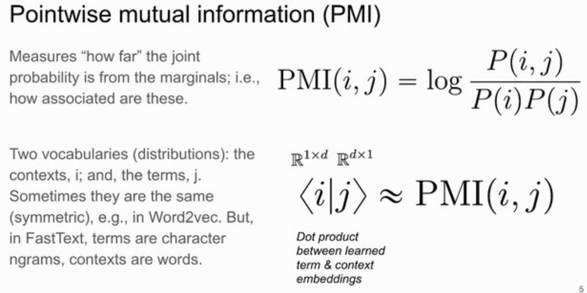
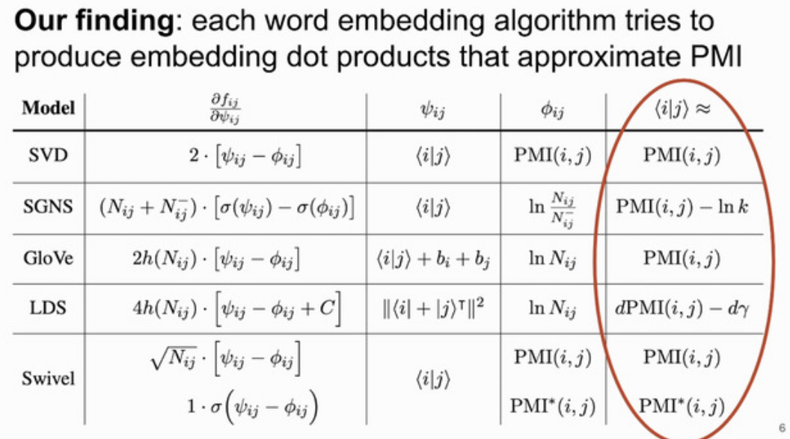
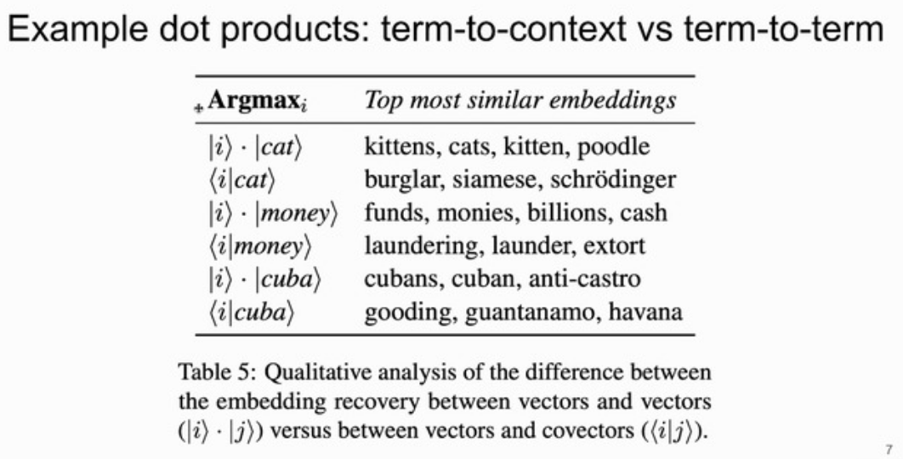
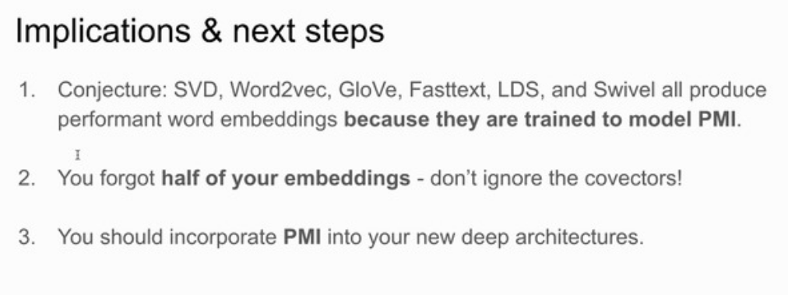

# Day3

## Scalable Zero-shot Entity Linking with Dense Entity Retrieval

Ledell Wu, Fabio Petroni, Martin Josifoski, Sebastian Riedel, Luke Zettlemoyer 

<https://slideslive.com/38939238>
<https://www.aclweb.org/anthology/2020.emnlp-main.519>

Abstract :
This paper introduces a conceptually simple, scalable, and highly effective BERT-based entity linking model, along with an extensive evaluation of its accuracy-speed trade-off. We present a two-stage zero-shot linking algorithm, where each entity is defined only by a short textual description. The first stage does retrieval in a dense space defined by a bi-encoder that independently embeds the mention context and the entity descriptions. Each candidate is then re-ranked with a cross-encoder, that concatenates the mention and entity text. Experiments demonstrate that this approach is state of the art on recent zero-shot benchmarks (6 point absolute gains) and also on more established non-zero-shot evaluations (e.g. TACKBP-2010), despite its relative simplicity (e.g. no explicit entity embeddings or manually engineered mention tables). We also show that bi-encoder linking is very fast with nearest neighbor search (e.g. linking with 5.9 million candidates in 2 milliseconds), and that much of the accuracy gain from the more expensive cross-encoder can be transferred to the bi-encoder via knowledge distillation. Our code and models are available at <https://github.com/facebookresearch/BLINK>

## Topic Modeling in Embedding Spaces

Adji Bousso Dieng, Francisco Ruiz, David Blei

<https://slideslive.com/38939405>
<https://virtual.2020.emnlp.org/paper_TACL.2093.html>
<https://arxiv.org/abs/1907.04907>
<https://github.com/adjidieng/ETM>

Like LDA but

- no need to trim stop words, rare words
- learns interpretable word embeddings in addition to topics
- no need to run optimization for evaluation
- generalization to unseen words

## Deconstructing word embedding algorithms

Kian Kenyon-Dean, Edward Newell, Jackie Chi Kit Cheung 

<https://slideslive.com/38938885>
<https://www.aclweb.org/anthology/2020.emnlp-main.681>

How come word2vec, fasttext, glove etc were so successful?

[interesting](8c716ab6-e253-4b05-8167-ad399382adbb)

They all try to find vectors such that i.j ~=PMI(i,j) where PMI is pointwise mutual information

