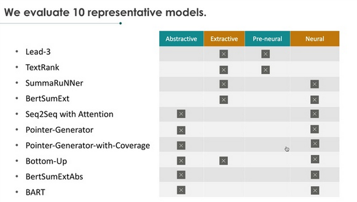
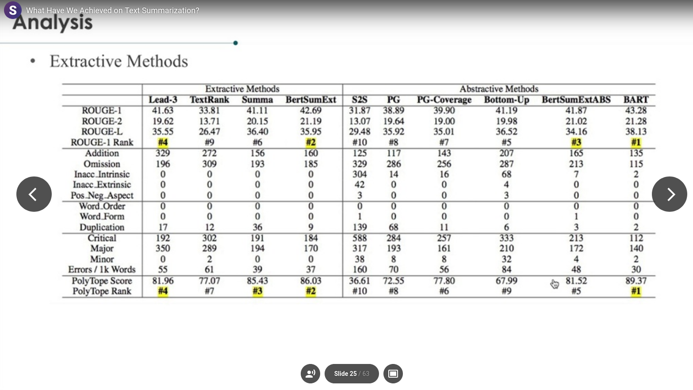

# Day1

## What Have We Achieved on Text Summarization?

Dandan Huang, Leyang Cui, Sen Yang, Guangsheng Bao, Kun Wang, Jun Xie, Yue Zhang 

<https://slideslive.com/38938815>
<https://www.aclweb.org/anthology/2020.emnlp-main.33>

- Multidimensional metric to detect several aspects of summarization like omission of important information, falsities, etc

Overview of some summarization models :

Top models :

1. BART (abstractive)
2. BertSumExt (ext)
3. Summa (ext)
4. Lead-3 (ext)

[interesting](8c716ab6-e253-4b05-8167-ad399382adbb)

ROUGE is decent for dataset averages but fairly bad for individual datapoints

